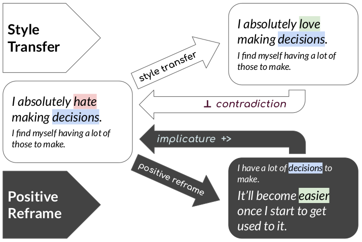

# Positive Psychology Frames

_Inducing Positive Perspectives with Text Reframing_

[[Read the Paper]](https://faculty.cc.gatech.edu/~dyang888/docs/acl22_reframing.pdf) | [[Download the Data]](https://www.dropbox.com/sh/pnoczmv0uyn51e6/AAAGek6yX12Yc4PA2RwtZeZKa?dl=0) | [[Demo]] (https://huggingface.co/spaces/Ella2323/Positive-Reframing)



## *Why Positive Frames?* 

This work was inspired by the need to escape the negative patterns of thinking that began to overwhelm the authors during the COVID-19 pandemic. We realized that what we needed was not some naive belief that everything would be okay if we ignored our problems. Instead, we needed _reframing_, or a shift in focus, with less weight on the negative things we can't control, and more weight on the positive things about ourselves and our situation which we can control.

_Positive reframing_ induces a complementary positive viewpoint (e.g. glass-half-full), which nevertheless supports the underlying content of the original sentence (see diagram above). The reframe implicates rather than contradicts the source, and the transformation is motivated by theoretically justified strategies from positive psychology (see _What's 'in the box?'_).

Our work shows how NLP can help lead the way by automatically reframing overly negative text using strategies from positive psychology.


## *What's 'in the box?'* 

The `Positive Psychology Frames` dataset contains **8,349** reframed sentence pairs, where the original sentence is drawn from a negative tweet (\#stressed), and a reframed copy is provided by a crowdworker who was trained in the methods of positive psychology. Our positive psychology frames taxonomy is defined below (with the distribution of labels shown on the left).

*  **Growth Mindset:** Viewing a challenging event as an opportunity for the author specifically to grow or improve themselves.
*  **Impermanence:** Saying bad things don't last forever, will get better soon, and/or that others have experienced similar struggles.
*  **Neutralizing:** Replacing a negative word with a neutral word.
*  **Optimism:** Focusing on things about the situation itself, in that moment, that are good (not just forecasting a better future).
*  **Self-Affirmation:** Talking about what strengths the author already has, or the values they admire, like love, courage, perseverance, etc.
*  **Thankfulness:** Expressing thankfulness or gratitude with key words like appreciate, glad that, thankful for, good thing, etc.


## *What can I do with this data?* 

State-of-the-art neural models can learn from our data how to (1) shift a negatively distorted text into a more positive perspective using a combination of strategies from positive psychology; and (2) recognize or classify the psychological strategies that are used to reframe a given source. 

As our paper baselines show, neural models still have a long ways to go before they can reliably generate positive perspectives. We see particular errors from _insubstantial changes, contradictions to the premise, self-contradictions, and hallucinations_. Overall, our suggests that our dataset can serve as a useful benchmark for building natural language generation systems with positive perspectives. For more information, please [read the paper](https://faculty.cc.gatech.edu/~dyang888/docs/acl22_reframing.pdf).

## *How do I run the baseline models?* 
**1. Set Up Environment**
* CUDA, cudnn
* anaconda
```
conda create --name reframe python=3.7
conda activate reframe
pip install -r requirements.txt
```
**2. Dataset Preparation**
The datasets are under the data/ folder.

-Random, SBERT, T5, BART: wholetrain.csv, wholetest.csv
The datasets contain fields: original_text, reframed_text, strategy, original_with_label

-GPT, GPT2: wholetrain_gpt.txt, wholetest.csv
The train data contains <startoftext> token and <endoftext> token for each sentence pair. Also, ‘reframed: ‘ token indicates the position where the reframed sentence begins for each sentence pair. Each sentence pair starts on a new line.

-Seq2SeqLSTM: for_train.txt, for_test.txt
The datasets contain paired texts separated by tab in each line: original_text \t reframed_text

-CopyNMT: train-original.txt, train-reframed.txt, validation-original.txt, validation-reframed.txt, test-original.txt, test-reframed.txt
Each file contains the original/reframed sentences separated by \n.


**3 . Run the Baseline Models**

Random, Sbert, T5, BART, GPT, GPT2: 
```python3 run.py —-arguments```
Arguments:
--model: choose from random, sbert, t5, BART
--setting: default is unconstrained, controlled/predict setting is supported for t5 and BART
--train: path to train data file
--dev: path to dev data file
--test: path to test data file

CopyNMT: Execute copynmt_train.sh and copynmt_eval.sh
```
bash copynmt_train.sh
bash copynmt_eval.sh
```

Seq2Seq-lstm: git clone https://github.com/bond005/seq2seq.git, replace the data files in the data/ folder and follow the instructions to train the seq2seq-lstm model

## *How do I cite this work?* 

**Citation:**

> Ziems, C., Li, M., Zhang, A., & Yang, D. (2022). Inducing Positive Perspectives with Text Reframing. In _Proceedings of the 60th Annual Meeting of the Association for Computational Linguistics (ACL)_.

**BibTeX:**

```tex
@inproceedings{ziems-etal-2022-positive-frames,
    title = "Inducing Positive Perspectives with Text Reframing",
    author = "Ziems, Caleb  and
      Li, Minzhi  and
      Zhang, Anthony  and
      Yang, Diyi",
    booktitle = "Proceedings of the 60th Annual Meeting of the Association for Computational Linguistics",
    month = may,
    year = "2022",
    address = "Online and Dublin, Ireland",
    publisher = "Association for Computational Linguistics"
}
```
